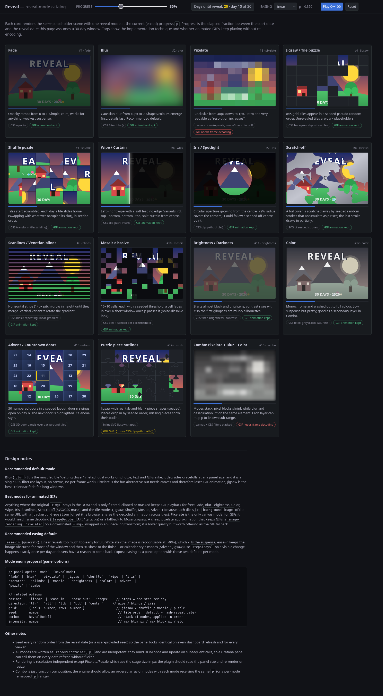
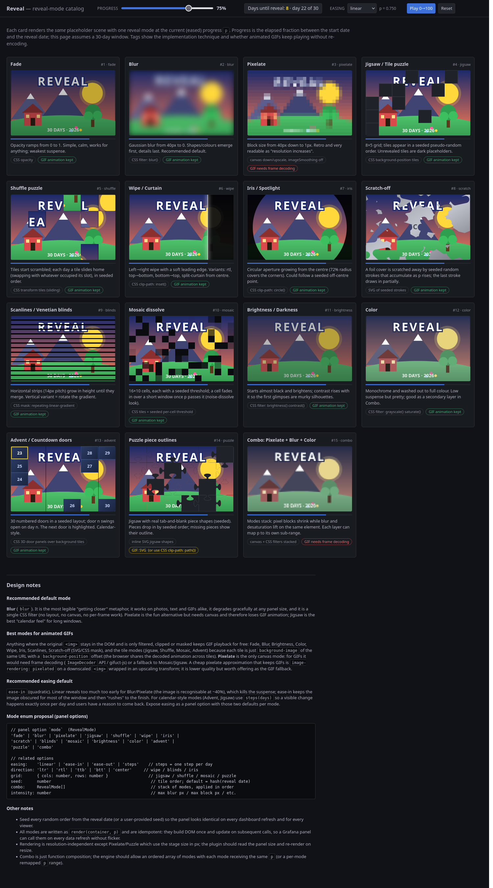
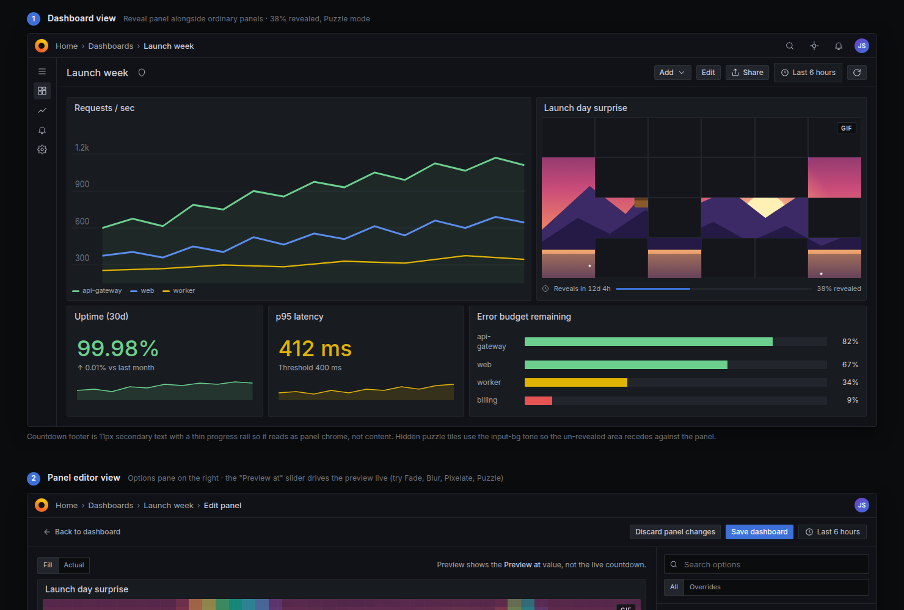
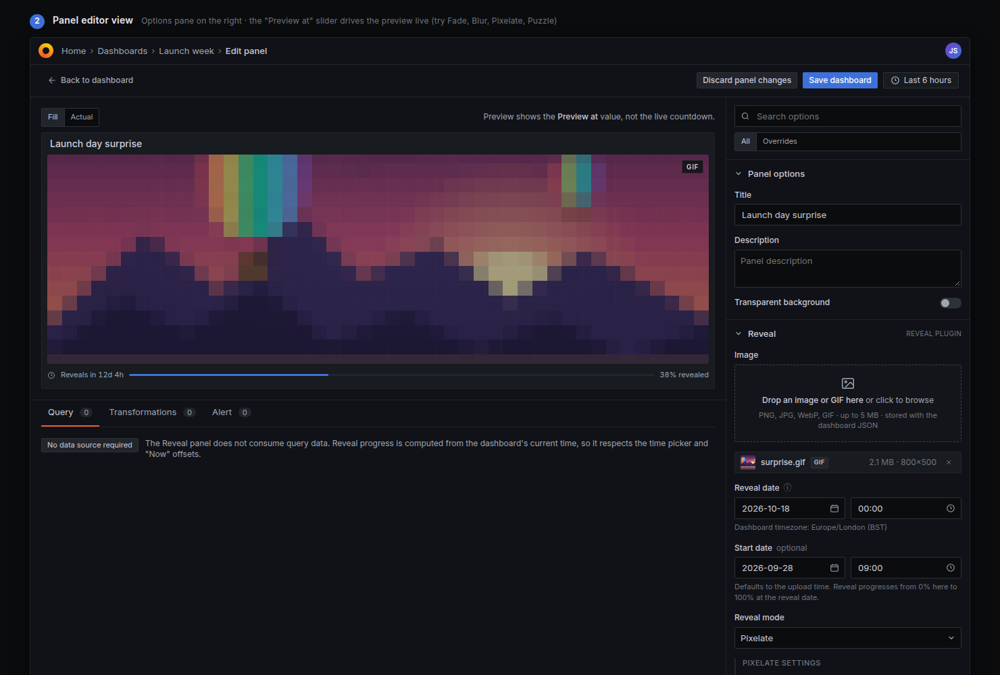

# Reveal - a Grafana panel that unveils an image over time

**Reveal** (`sparks1223-reveal-panel`) is a Grafana panel plugin that holds one image (or GIF)
and a _reveal date_. Between a start date and the reveal date the panel renders the image
progressively less obscured - blurred, pixelated, tile by tile, door by door - until it is
shown in full. Think "new car under a sheet", "product launch countdown" or an advent calendar
that lives on your dashboard.

- Progress `p` in `[0, 1]` is the elapsed fraction between `startDate` and `revealDate`.
- The selected **mode** renders the image `p`-revealed; an **easing** shapes how fast it opens up.
- All randomness (tile order, door layout, scratch strokes) is **seeded from the reveal date**, so
  every viewer and every refresh sees exactly the same state.
- Requires Grafana **>= 12.3.0**.

## Reveal modes

| Mode                 | How it looks                                                                  | Technique                       | GIF-safe         |
| -------------------- | ----------------------------------------------------------------------------- | ------------------------------- | ---------------- |
| `fade`               | Opacity ramps from 0 to 1. Simple, calm; weakest suspense.                    | CSS `opacity`                   | yes              |
| `blur` **(default)** | Gaussian blur from 40 px to 0. Shapes and colours emerge first, details last. | CSS `filter: blur()`            | yes              |
| `pixelate`           | Block size from 40 px down to 1 px. "Resolution increases."                   | canvas down/upscale             | no (first frame) |
| `jigsaw`             | 8x5 grid; tiles appear in a seeded pseudo-random order.                       | CSS background tiles            | yes              |
| `shuffle`            | Tiles start scrambled; each step one tile slides home.                        | CSS transform tiles             | yes              |
| `wipe`               | Left-to-right wipe with a soft edge; rtl / ttb / btt / centre variants.       | CSS `clip-path: inset()`        | yes              |
| `iris`               | Circular aperture growing from the centre.                                    | CSS `clip-path: circle()`       | yes              |
| `scratch`            | A foil cover scratched away by seeded strokes.                                | SVG mask                        | yes              |
| `blinds`             | Horizontal strips grow until they merge.                                      | CSS mask gradient               | yes              |
| `mosaic`             | 16x10 cells with seeded thresholds fade in (noise dissolve).                  | CSS tiles                       | yes              |
| `brightness`         | Almost black, brightening; murky silhouettes first.                           | CSS `brightness()`/`contrast()` | yes              |
| `color`              | Monochrome and washed out to full colour. Nice as a combo layer.              | CSS `grayscale()`/`saturate()`  | yes              |
| `advent`             | Numbered doors in a seeded layout; door _n_ opens on day _n_.                 | CSS 3D door panels              | yes              |
| `puzzle`             | Jigsaw with real tab-and-blank piece shapes; missing pieces show outlines.    | inline SVG                      | partial          |
| `combo`              | Ordered stack of modes (e.g. pixelate + blur + color) sharing the same `p`.   | canvas + CSS                    | no               |

**Easings:** `linear`, `easeIn` (default - keeps the image obscured for most of the window, then
rushes to the finish), `easeOut`, `easeInOut`, `steps` (one visible change per whole day;
recommended for `jigsaw` and `advent` so people come back daily).

Other options: `timeSource` (`browser` clock or dashboard time), `showCountdown`, `caption`
(shown once fully revealed), `animateBeforeReveal` (GIFs are frozen until 100 % unless enabled,
because moving frames leak the surprise), and an editor-only `previewOverride` (0-100) to
inspect any point of the reveal. See [`src/types.ts`](src/types.ts) for the full option contract
and [`mockups/ARCHITECTURE.md`](mockups/ARCHITECTURE.md) for the engine design.

## Screenshots

Design mockups live in [`mockups/screenshots`](mockups/screenshots):

|                                                                         |                                                                  |
| ----------------------------------------------------------------------- | ---------------------------------------------------------------- |
|         |  |
| All modes at p = 0.35                                                   | All modes at p = 0.75                                            |
|  |      |
| Panel on a dashboard                                                    | Panel editor                                                     |

Open [`mockups/reveal-modes.html`](mockups/reveal-modes.html) in a browser to scrub through every
mode interactively.

## Getting started (Docker only)

Everything - installing dependencies, type-checking, linting, testing, building, packaging and
running Grafana - happens inside Docker. **Do not run `npm` on the host.** You need Docker Engine
with the Compose v2 plugin (`docker compose`) and GNU make.

```bash
make build        # production build -> ./dist   (installs deps into a Docker volume on first run)
make up           # Grafana 12.x at http://localhost:3000 with ./dist and the demo dashboard mounted
```

Open <http://localhost:3000>. Anonymous access is enabled with the Admin role, so there is no
login; the provisioned **Reveal demo** dashboard shows four panels (blur, pixelate, jigsaw,
advent) revealing the same image between 2026-10-01 and 2026-11-01.

Day-to-day targets:

| Target                                       | What it does                                                                                      |
| -------------------------------------------- | ------------------------------------------------------------------------------------------------- |
| `make install`                               | `npm ci` (or `npm install` if there is no lockfile yet) into the `node_modules` volume            |
| `make build`                                 | `npm run build` -> `./dist`                                                                       |
| `make dev`                                   | `npm run dev` (webpack watch + livereload on :35729). Run in a second terminal next to `make up`. |
| `make test` / `make typecheck` / `make lint` | Jest, `tsc --noEmit`, ESLint                                                                      |
| `make check`                                 | typecheck + lint + test                                                                           |
| `make up` / `make down` / `make logs`        | Grafana via `docker compose` (`up` builds first)                                                  |
| `make validate`                              | Zips `./dist` and runs `@grafana/plugin-validator` against it                                     |
| `make package`                               | `./sparks1223-reveal-panel-<version>.zip` ready for signing/upload                                |
| `make image`                                 | One-image demo: `docker build --target runtime -t reveal-grafana .`                               |
| `make run-image`                             | Runs that image on <http://localhost:3000>                                                        |
| `make dist-export`                           | Builds the plugin entirely inside Docker (with all checks) and exports `./out/dist`               |
| `make clean` / `make distclean`              | Remove build outputs / also the Docker volumes and containers                                     |

Pick another Grafana build for `make up` with `GRAFANA_VERSION=12.3.0 GRAFANA_IMAGE=grafana-enterprise make up`.

The root [`Dockerfile`](Dockerfile) has four stages: `deps` (npm install), `build`
(typecheck + lint + tests + webpack; pass `--build-arg SKIP_CHECKS=1` to skip the checks),
`dist` (`FROM scratch`, only the built plugin) and `runtime` (Grafana with the plugin and the
provisioning baked in). Node containers run as root, so the Makefile re-owns generated files
(`dist`, `coverage`, `.eslintcache`, `package-lock.json`, zips) to your user after each target.

### Running the plugin in your own Grafana

Copy `dist/` to `<grafana plugins dir>/sparks1223-reveal-panel` (or install the zip from
`make package`) and, until the plugin is signed, allow it:

```ini
[plugins]
allow_loading_unsigned_plugins = sparks1223-reveal-panel
```

Then restart Grafana and add a **Reveal** panel. Upload an image, set the reveal date, pick a mode.

## Repeating schedules

Switch on **Schedule > Repeat** to cycle a reveal: `every`, `revealOver`, `showFor`, clock or
start-date alignment, an `offset`, and a seeded `chance` per cycle. Two panels with
`every: 2m, showFor: 1m` and offsets `0` / `1m` alternate on even and odd minutes; a chance below
100 makes panels pop up pseudo-randomly, identically for every viewer.

### Demo dashboards

- **Reveal demo** (`/d/reveal-demo`): the four date-based modes plus even/odd/random schedule panels.
- **Reveal alternating** (`/d/reveal-alternating`): two Reveal panels across the top that alternate
  every minute above ordinary metric panels. Surprise A uses offset `0`, Surprise B offset `1m`.

## Secrecy caveat - please read

**v1 is cosmetic, not confidential.** The uploaded image is stored _inline_ in the dashboard JSON
as a `data:` URL. Anyone with read access to the dashboard (the UI's _Inspect -> Panel JSON_, the
`/api/dashboards/uid/...` endpoint, exports, snapshots, version history) can pull the full image
out at any time. The browser also downloads the whole image on every page load; the reveal is
applied client-side.

Use Reveal for fun and anticipation among people you trust with the secret. If the image genuinely
must stay hidden until the date, wait for the v2 backend (see Roadmap) or keep the image off
Grafana entirely.

## Image size limits

Images are base64-encoded into the dashboard model, which inflates them by ~33 % and is saved with
every dashboard version.

- **Warning at 1 MB** (encoded): the editor warns that dashboards get slow to load and save.
- **Hard cap at 4 MB** (encoded): larger files are rejected. Resize or re-encode (WebP/JPEG)
  before uploading.

Prefer small, pre-scaled images (a 1280 px wide JPEG/WebP is plenty for a dashboard panel).
Animated GIFs count their full file size and only animate once fully revealed unless
`animateBeforeReveal` is on.

### Cleaning up old images

There is no separate image store in v1: the image lives inside the panel's options, so

- **Remove image** (the x next to the file in the panel editor) or deleting the panel removes it
  from the current dashboard version. Save the dashboard afterwards.
- **Dashboard version history** keeps a copy of every saved version, including old images.
  Grafana trims it to `[dashboards] versions_to_keep` (default 20). Lower it, e.g.
  `GF_DASHBOARDS_VERSIONS_TO_KEEP=5`, to reclaim space sooner; the demo compose file sets it.
- **Expire date** hides the image after a moment of your choosing, but it does not delete it.

## Roadmap

- **v2 - Go backend.** Store the original image server-side (plugin resource) and have the
  backend serve _already-degraded_ renders for the current progress. The browser never receives
  the full image before the reveal date, closing the secrecy hole above.
- **GIF frame decoding** for canvas modes (`pixelate`, `combo`) so animated GIFs stay animated
  while obscured (frame-count cap to bound CPU), plus a cheap `image-rendering: pixelated`
  fallback.
- Shareable "reveal happened" annotations and an optional confetti moment at 100 %.
- Signed release on the Grafana plugin catalog.

## Development notes

- Scaffolded with `@grafana/create-plugin`; webpack/jest/eslint configuration lives in
  `.config/` and must not be edited (extend it instead - see
  `.config/AGENTS/instructions.md`).
- `src/types.ts` is the contract between the reveal engine (`src/reveal`), the panel
  (`src/components`) and the option editors. Keep it in sync with `mockups/ARCHITECTURE.md`.
- Any change to `src/plugin.json` requires restarting Grafana (`make down && make up`).
- E2E tests use `@grafana/plugin-e2e` (`tests/`); run them against `make up`.

## License

Apache-2.0 - see [LICENSE](LICENSE).
