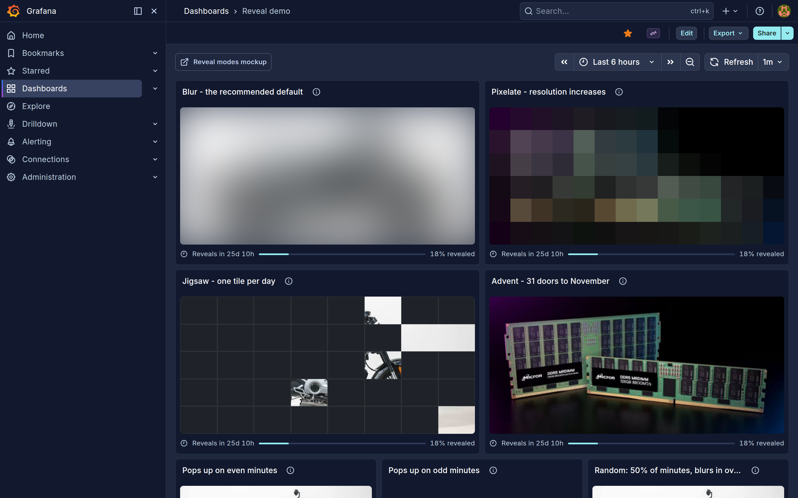
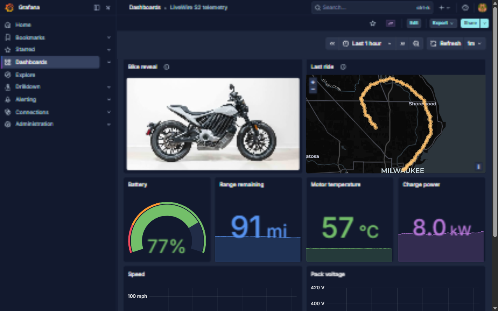
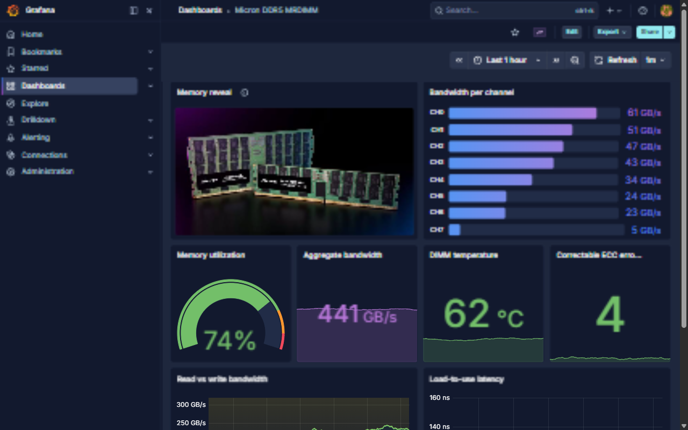
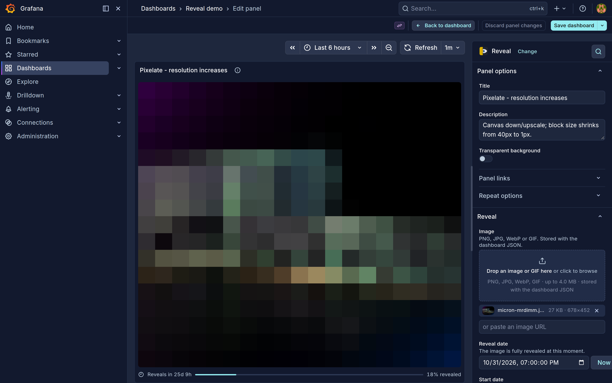

# Reveal - Timed Image Reveals for Grafana

Progressively reveals an image or GIF as a date approaches, or on a repeating schedule. A teaser panel for launches, birthdays, advent calendars and dashboard surprises.

## Screenshots

<p>
  
  
  
</p>
<p>
  
</p>

## Quick Start (Provides Grafana and Reveal via Docker.)

```bash
git clone https://github.com/SparkAnswers/reveal
cd reveal
docker compose up

# Grafana:   http://localhost:3000/   (anonymous viewer; admin / admin to edit)
# Demos:     /d/reveal-demo, /d/reveal-alternating (LiveWire), /d/reveal-micron (Micron)
```

## Configuration

**Panel options** (per dashboard panel, under **Reveal**):

| Option                     | Description                                                                                                                                                                 |
| -------------------------- | --------------------------------------------------------------------------------------------------------------------------------------------------------------------------- |
| Image                      | Drop a PNG, JPG, WebP or GIF, or paste a URL. Stored in the dashboard JSON; large images are downscaled, files over 4 MB are rejected                                       |
| Reveal date                | The image is fully revealed at this moment                                                                                                                                  |
| Start date                 | Stamped to "now" when you pick a reveal date; the reveal runs from here to the reveal date                                                                                  |
| Expire date                | Optional. After this the image is hidden again                                                                                                                              |
| Reveal mode                | `Blur` (default), `Pixelate`, `Fade`, `Brightness`, `Color`, `Wipe`, `Iris`, `Blinds`, `Jigsaw`, `Puzzle`, `Shuffle`, `Mosaic`, `Scratch-off`, `Advent`, `Combo`, `Instant` |
| Easing curve               | `Ease in` (default) keeps the surprise hidden longest; `Steps` reveals in jumps by count or by a **Step interval** such as `1h` or `1d`                                     |
| Time source                | Browser clock (default) or dashboard time, which lets you scrub with the time picker                                                                                        |
| Show countdown             | Footer with time remaining and percent revealed                                                                                                                             |
| Caption                    | Text shown over the image at 100%                                                                                                                                           |
| Background                 | Colour behind transparent images and in unrevealed areas                                                                                                                    |
| Animate GIFs before reveal | Off (default) keeps GIFs frozen on their first frame until fully revealed                                                                                                   |

**Schedule** (repeat instead of a single reveal date):

| Option           | Description                                                                                                              |
| ---------------- | ------------------------------------------------------------------------------------------------------------------------ |
| Repeat           | Cycle the reveal. The panel is completely blank between cycles                                                           |
| Every            | Cycle length, e.g. `2m`, `15m`, `1h`                                                                                     |
| Reveal over      | How long the reveal takes each cycle. Empty = instant                                                                    |
| Show for         | How long it stays visible. Empty = until the next cycle                                                                  |
| Align cycles to  | `Clock` (minute/hour boundaries, same for every panel) or `Start date`                                                   |
| Offset           | Shift this panel's cycle. `Every 2m` with offsets `0` and `1m` gives two panels that alternate and are never on together |
| Chance per cycle | Percent of cycles that show. Seeded, so every viewer sees the same pattern                                               |

**Preview** (editor only): a slider that scrubs the reveal from 0 to 100% without affecting viewers.

Every seeded order (tiles, doors, scratches, random cycles) derives from the reveal date, so all viewers see the same state. Three demo dashboards ship with the stack: `Reveal demo` (all modes plus even/odd/random schedule panels), `LiveWire S2 telemetry` and `Micron DDR5 MRDIMM` (each with a scheduled reveal beside product metrics).

## Usage

1. Add a "Reveal" panel to your dashboard; no data source is needed
2. Drop in an image and set a reveal date, or switch on Repeat under Schedule
3. Pick a reveal mode and scrub the Preview slider to see how it will look
4. Save; the panel updates on its own timer, every second in the last hour

**Please read:** the full image is part of the dashboard JSON, so the reveal is cosmetic rather than a security boundary. Anyone with dashboard read access can extract it early. Removing the image and saving the dashboard drops it from the current version; Grafana's dashboard version history keeps older copies until trimmed (`GF_DASHBOARDS_VERSIONS_TO_KEEP`).

---

## Development

**Developing the plugin?** All builds run in Docker; nothing calls npm on the host.
`make dev` runs webpack in watch mode with livereload next to `docker compose up`.

## Architecture

```
Panel editor  ──image (base64) + dates + mode──▶  dashboard JSON
                                                      │
Browser (panel)  ──timer tick──▶  progress p = (now − start) / (reveal − start)
                                   └─▶ easing ─▶ reveal mode (CSS filter / clip-path / tiles / canvas)
```

Frontend only: no backend, no uploads to a server.

- [docs/TECHNICAL.md](docs/TECHNICAL.md) - full technical details: every mode and easing, the Makefile targets, image size limits, the secrecy caveat, storage cleanup and the roadmap
- [mockups/ARCHITECTURE.md](mockups/ARCHITECTURE.md) - design notes, the reveal-mode catalog and the v2 plan (a Go backend serving server-degraded images for true secrecy)

## Plugin Development

```bash
make install     # npm ci inside the node image
make build       # production bundle -> ./dist
make check       # typecheck + lint + jest
make up          # Grafana 12.x with the plugin and demo dashboards
make dev         # webpack watch + livereload
make validate    # Grafana plugin-validator against a zip of ./dist
make package     # ./sparkanswers-reveal-panel-<version>.zip
```

Requires Docker Engine with Compose v2 and BuildKit (`docker.io docker-compose-v2 docker-buildx` on Ubuntu).
